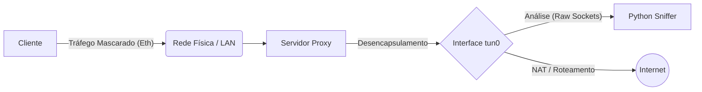

# Monitor de Tráfego de Rede via Túnel (Raw Sockets)

Este projeto implementa uma ferramenta de monitoramento de tráfego de rede em tempo real desenvolvida em **Python** (utilizando Raw Sockets), operando sobre uma infraestrutura de tunelamento customizada escrita em **C**.

O objetivo é interceptar, analisar e registrar pacotes de rede (Camadas de Rede, Transporte e Aplicação) que trafegam através de uma interface virtual (`tun0`), simulando um cenário de Proxy/Gateway em uma rede corporativa.

## 📋 Sobre o Projeto

O sistema é dividido em dois componentes principais:

1.  **Infraestrutura de Túnel (C):** Responsável por criar uma interface virtual (`tun0`), encapsular o tráfego dos clientes e transportá-lo até o servidor (proxy), onde é realizado o NAT (Masquerading) para acesso à internet.
2.  **Network Sniffer (Python):** Uma aplicação gráfica que "escuta" a interface `tun0` no servidor, decodifica os cabeçalhos dos pacotes (IP, TCP, UDP, ICMP, HTTP, DNS, etc.) e exibe estatísticas em tempo real, além de salvar logs em CSV.

## 🏗️ Arquitetura da Rede

O cenário simula clientes em uma rede interna que acessam a internet através de um servidor Proxy. O tráfego é encapsulado pelo programa túnel.



* **Cliente:** Executa o túnel em modo cliente (`-c`), alterando sua rota padrão para passar pela interface `tun0`.
* **Servidor:** Executa o túnel em modo servidor (`-s`), recebe os pacotes, encaminha para a internet e permite que o Sniffer analise o tráfego antes do NAT.

## 🚀 Funcionalidades do Sniffer

* **Interface Gráfica (GUI):** Desenvolvida com `tkinter` e tema *Dracula*, exibindo contadores em tempo real.
* **Análise de Protocolos:**
    * **L3 (Rede):** IPv4, IPv6, ICMP (com extração de Type/Code).
    * **L4 (Transporte):** TCP, UDP (Portas de origem e destino).
    * **L7 (Aplicação):** Identificação de HTTP, DNS, DHCP e NTP baseada em portas.
* **Monitoramento de Clientes:** Tabela dinâmica que mostra quais IPs do túnel (ex: `172.31.66.101`) estão ativos e o volume de dados consumido.
* **Logs em CSV:** Geração automática de arquivos de log separados por camada.

## 🛠️ Pré-requisitos

* **Sistema Operacional:** Linux (Necessário para suporte a Raw Sockets e interface TUN/TAP).
* **Dependências de Sistema:**
    * `gcc` e `make` (para compilar o túnel).
    * `python3` e `python3-tk` (para o sniffer).
    * `iptables` (para o script de roteamento do servidor).

**Exemplo de instalação no Ubuntu/Debian:**
```bash
sudo apt-get update
sudo apt-get install build-essential python3-tk iptables net-tools
```

## ⚙️ Instalação e Compilação

1. **Clone o repositório:**
   ```bash
   git clone [https://github.com/seu-usuario/seu-projeto.git](https://github.com/seu-usuario/seu-projeto.git)
   cd seu-projeto
   ```
2. **Compile o Túnel (Código C):**
   Utilize o Makefile fornecido para gerar o executável `traffic_tunnel`.
   ```bash
   make
   ```

## ▶️ Como Rodar

Para o sistema funcionar, você precisa de pelo menos duas máquinas (ou containers/VMs) na mesma rede LAN: uma atuando como **Servidor** e outra como **Cliente**[cite: 96, 97].

### 1. Configurando o Servidor (Proxy)
Na máquina que servirá como gateway e onde o sniffer irá rodar:

```bash
# Sintaxe: sudo ./traffic_tunnel <interface_fisica> -s
# Exemplo (se sua interface de rede for eth0):
sudo ./traffic_tunnel eth0 -s
```
Isso irá configurar a tun0 com IP 172.31.66.1 e habilitar o NAT

### 2. Configurando o Cliente
Na máquina que irá gerar o tráfego:

```bash
# Sintaxe: sudo ./traffic_tunnel <interface_fisica> -c <script_cliente>
# Exemplo (usando o script client1.sh fornecido):
sudo ./traffic_tunnel eth0 -c client1.sh
```
Isso configura a tun0 do cliente e altera a rota default para passar pelo túnel.

### 3. Executando o Sniffer (Monitor)
Na máquina Servidor, abra um novo terminal e execute a aplicação Python:

```bash
# Necessário rodar como root para acesso aos Raw Sockets
sudo python3 sniffer.py
```
A interface gráfica abrirá exibindo as estatísticas zeradas. Assim que o Cliente gerar tráfego (navegar na internet, ping, etc.), os dados aparecerão na tela.

## 📂 Logs Gerados

O sniffer gera automaticamente três arquivos CSV no diretório de execução:

* **`camada_internet.csv`**:
  * **Colunas:** `Data_Hora`, `Protocolo`, `IP_Origem`, `IP_Destino`, `ID_Proto_Carga`, `Info_Extra`, `Tamanho_Total` .
* **`camada_transporte.csv`**:
  * **Colunas:** `Data_Hora`, `Protocolo`, `IP_Origem`, `Porta_Origem`, `IP_Destino`, `Porta_Destino`, `Tamanho_Total` .
* **`camada_aplicacao.csv`**:
  * **Colunas:** `Data_Hora`, `Protocolo`, `Informacoes` (Ex: "Query DNS" ou trechos de pacotes HTTP).

## 🧩 Estrutura de Arquivos

* `sniffer.py`: Aplicação principal de monitoramento (Python).
* `traffic_tunnel.c`: Código fonte principal do túnel.
* `tunnel.c` / `tunnel.h`: Biblioteca de manipulação da interface TUN/TAP.
* `server.sh`: Script de configuração de rede do servidor (NAT/IP Forwarding).
* `client1.sh` / `client2.sh`: Scripts de configuração de rede dos clientes.
* `Makefile`: Automação de compilação.

---
**Nota:** Este projeto foi desenvolvido como parte da disciplina de Redes de Computadores para estudo de Raw Sockets e arquitetura TCP/IP.
   

